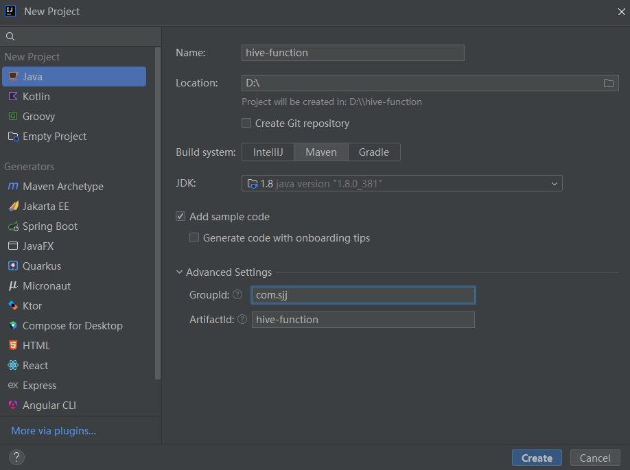
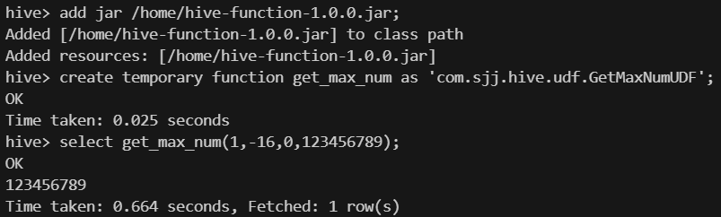
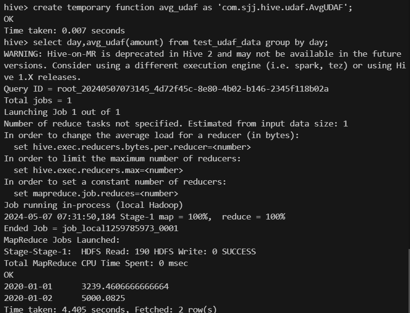
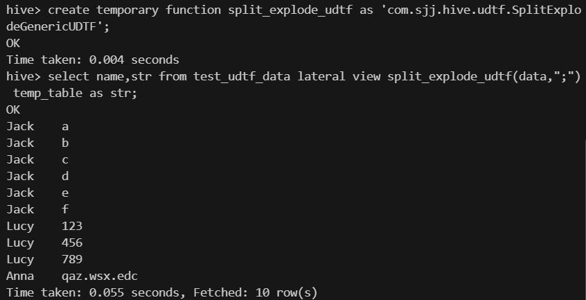

# Hive自定义函数开发

# 0 前言

本文的完整代码详见：[hive-function](https://github.com/songjjkx/hive-function)

## 0.1 简介

在工作过程中，有时会遇到Hive SQL自带的函数无法满足需求的情况，对此，可以编写一些自定义函数去满足实际需求。

Hive SQL自带的函数按照入参和出参的数量不同，可以划分为三类函数

1. 当**入参和出参行数均为1**时，属于**UDF(User-Defined Function)**函数，即用户自定义函数，比如abs()、if()等
2. 当**入参行数大于等于1、出参行数等于1**时，属于**UDAF(User-Defined Aggregate Function)**函数，即用户自定义聚合函数，比如count()、sum()等
3. 当**入参行数等于1、出参行数大于等于1**时，属于**UDTF(User-Defined Table-Generating Function)**函数，即用户自定义表生成函数，比如explode()等。UDTF函数通常需要结合LATERAL VIEW关键字使用，从而在查询中展示由UDTF函数输出的多行数据

## 0.2 开发环境配置

本文基于Java语言进行开发，需提前安装JDK8及Maven

**1.使用IDEA新建Maven项目**



**2.在pom.xml文件中添加开发Hive自定义函数所需要的依赖：**

```xml
<!--添加hive依赖-->
<dependency>
    <groupId>org.apache.hive</groupId>
    <artifactId>hive-exec</artifactId>
    <version>3.1.0</version>
    <scope>provided</scope>
</dependency>
```

## 0.3 测试环境配置

测试环境为通过docker搭建的Hive运行环境

在将开发完的程序打包上传至服务器后，通过如下步骤在Hive中创建函数

**1.将打好的jar包上传至docker**

```bash
# 复制本地文件至docker
docker cp /home/lighthouse/hive-function-1.0.0.jar 容器id:docker中的路径
# 进入正在运行的docker容器
docker exec -it 容器id /bin/bash
```

**2.启动Hive，创建函数（分为两种类型，一种是临时函数，一种是永久函数）**

- 临时函数，仅在当前会话窗口有效，适合临时使用

```bash
# 添加jar包
add jar /home/hive-function-1.0.0.jar;
# 创建临时函数
create temporary function get_max_num as 'com.sjj.hive.udf.GetMaxNumUDF';
```

- 永久函数，一直有效，适合长期使用

```bash
# 将jar包上传至hdfs
hadoop fs -put /home/hive-function-1.0.0.jar /user/hive/jars;
# 创建永久函数
create function get_max_num as 'com.sjj.hive.udf.GetMaxNumUDF' using jar 'hdfs:///home/hive-function-1.0.0.jar';
```

# 1 UDF函数

Hive为用户开发自定义UDF函数提供了两个类，一个是简单的UDF类，另一个是较为复杂的GenericUDF类。在实际开发时，需要继承其中的一个类，并实现指定的方法

## 1.1 简单UDF开发

简单UDF函数的开发需要继承org.apache.hadoop.hive.ql.exec.UDF类，并编写evaluate方法

**开发流程：**

1. 新建一个类并继承UDF
2. 编写evaluate()方法，用于实现具体的处理逻辑

下面通过一个需求演示一个完整的开发及部署流程

**需求**：编写一个get_max_num(num1,num2,…)函数，返回入参数字中的最大值，入参可以接收多个数字

**具体步骤：**

1.编写udf函数代码，详见：[GetMaxNumUDF](https://github.com/songjjkx/hive-function/blob/main/src/main/java/com/sjj/hive/udf/GetMaxNumUDF.java)

**注：**

- 方法名称必须为evaluate，不然会报错
- evaluate方法的输入及输出数据类型与hive输入及输出数据类型需要对应
- Hive会自动匹配入参类型及数量相符的evaluate方法
- @Description注解为可选项，其中，name为函数名称，value为函数用法，extended为函数使用样例。在使用hive的”desc function”或”desc function extended”语句查看函数时，会展示上述字段的内容

2.使用maven package打包

3.上传至服务器并在Hive中创建函数get_max_num，详见0.3测试环境配置

4.建表并添加测试数据

```sql
-- 创建测试表
create table test_udf_data
(
    t1    tinyint,
    i1    int,
    i2    int,
    b1    bigint,
    b2    bigint,
    b3    bigint,
    f1    float,
    d1    double
);

-- 添加测试数据
insert into test_udf_data values 
(1,11,10,21474836480,190798520,-12797288,1.08287,20.42727),
(2,22,20,96270962,2919617,9054375,782.48307,9.7080772),
(3,33,30,18505,15232156,-184192,498123.01,29.2168);
```

5.使用函数



## 1.2 复杂GenericUDF开发

采用简单UDF开发的函数，只能接收特定数量的入参，如果想让UDF函数可以接收多种指定数量的入参，或者需要在运行之前进行一些初始化的操作，则需要使用复杂GenericUDF

**开发流程：**

1. 新建一个类并继承GenericUDF类
2. 实现initialize()方法，用于做一些初始化和参数校验
3. 实现evaluate()方法，用于实现具体的处理逻辑
4. 实现getDisplayString()方法，用于在使用explain查看执行计划时输出函数信息
5. 测试，编写函数说明（可选）

**需求**：编写一个get_max_num_gen(num1,num2,…)函数，返回入参数字中的最大值，入参可以接收任意基本类型

**具体步骤：**

1.编写udf函数代码，详见：[GetMaxNumGenericUDF](https://github.com/songjjkx/hive-function/blob/main/src/main/java/com/sjj/hive/udf/GetMaxNumGenericUDF.java)

2.打包之后的测试步骤同简单UDF函数

# 2 UDAF函数

Hive为用户开发自定义UDAF函数提供了两个类，一个是简单的UDAF类，另一个是较为复杂的GenericUDAF类。在实际开发时，需要继承其中的一个类，并实现指定的方法

## 2.1 简单UDAF函数开发

简单UDAF函数的开发需要继承org.apache.hadoop.hive.ql.exec.UDAF类，并编写evaluate方法

**开发流程：**

1. 新建一个类并继承UDAF
2. 在内部创建一个实现UDAFEvaluator接口的内部类，用于执行具体处理逻辑

下面通过一个需求演示一个完整的开发及部署流程

**需求：**编写一个avg_udaf(num)函数，计算平均值

**具体步骤：**

1.编写udaf函数代码，详见：[AvgUDAF](https://github.com/songjjkx/hive-function/blob/main/src/main/java/com/sjj/hive/udaf/AvgUDAF.java)

**注：**

- 若要支持不同类型及数量的入参，需创建多个UDAFEvaluator的实现类，详见：[https://github.com/apache/hive/blob/master/contrib/src/java/org/apache/hadoop/hive/contrib/udaf/example/UDAFExampleMax.java](https://github.com/apache/hive/blob/master/contrib/src/java/org/apache/hadoop/hive/contrib/udaf/example/UDAFExampleMax.java)

2.使用maven package打包

3.上传至服务器并在Hive中创建函数avg_udaf，详见0.3测试环境配置

4.建表并添加测试数据

```sql
-- 创建测试表
create table test_udaf_data
(
    day       string,
    amount    double
);

-- 添加测试数据
insert into test_udaf_data values 
("2020-01-01",100.01),
("2020-01-01",1000.02),
("2020-01-01",2000.789),
("2020-01-02",501.0),
("2020-01-02",600.963);
```

5.使用函数



## 2.2 复杂GenericUDAF函数开发

如果想让UDAF函数可以接收多种类型或数量的入参，或者需要在运行之前进行一些初始化的操作，则需要使用复杂GenericUDAF

**开发流程：**

1. 新建一个类并继承GenericUDAF类
2. 实现getEvaluator()方法，用于选择对应的计算类
3. 创建一个继承GenericUDAFEvaluator的类，编写其内部方法用于实现具体的处理逻辑

**需求**：编写一个avg_udaf_gen(num)函数，计算平均值

**具体步骤：**

1.编写udaf函数代码，详见：[AvgGenericUDAF](https://github.com/songjjkx/hive-function/blob/main/src/main/java/com/sjj/hive/udaf/AvgGenericUDAF.java)

2.打包之后的测试步骤同简单UDAF函数

# 3 UDTF函数

Hive为用户开发自定义UDTF函数提供了一个GenericUDTF类，在实际开发时，需要继承GenericUDTF类，并实现指定的方法

## 3.1 UDTF函数开发

UDTF函数的开发需要继承org.apache.hadoop.hive.ql.udf.generic.GenericUDTF类，并编写process方法

**开发流程：**

1. 新建一个类并继承GenericUDTF
2. 编写process方法，用于实现具体的处理逻辑

下面通过一个需求演示一个完整的开发及部署流程

**需求**：编写一个split_explode_udtf(data,delimiter)函数，将data用delimiter分隔开，并用多行返回分隔后的数据

**具体步骤：**

1.编写udtf函数代码，详见：[SplitExplodeGenericUDTF](https://github.com/songjjkx/hive-function/blob/main/src/main/java/com/sjj/hive/udtf/SplitExplodeGenericUDTF.java)

2.使用maven package打包

3.上传至服务器并在Hive中创建函数split_explode_udtf，详见0.3测试环境配置

4.建表并添加测试数据

```sql
-- 创建测试表
create table test_udtf_data
(
    name    string,
    data    string
);

-- 添加测试数据
insert into test_udtf_data values 
("Jack","a;b;c;d;e;f"),
("Lucy","123;456;789"),
("Anna","qaz.wsx.edc");
```

5.使用函数



**参考链接：**

1. [https://florianwilhelm.info/2016/10/python_udf_in_hive/](https://florianwilhelm.info/2016/10/python_udf_in_hive/)
2. [https://cwiki.apache.org/confluence/display/Hive/GettingStarted](https://cwiki.apache.org/confluence/display/Hive/GettingStarted)
3. [https://cwiki.apache.org/confluence/display/Hive/GenericUDAFCaseStudy](https://cwiki.apache.org/confluence/display/Hive/GenericUDAFCaseStudy)
4. [https://cloud.tencent.com/developer/article/1918556](https://cloud.tencent.com/developer/article/1918556)